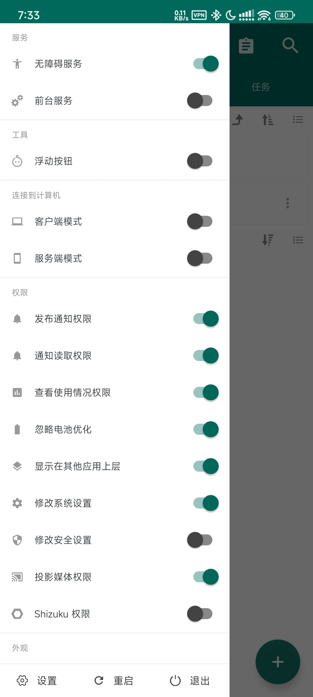
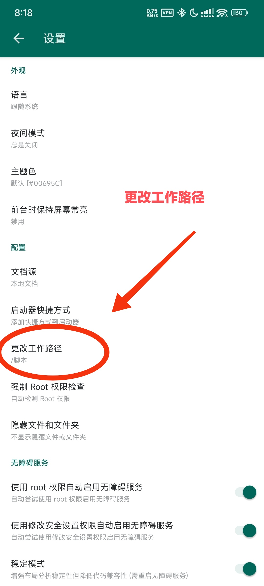
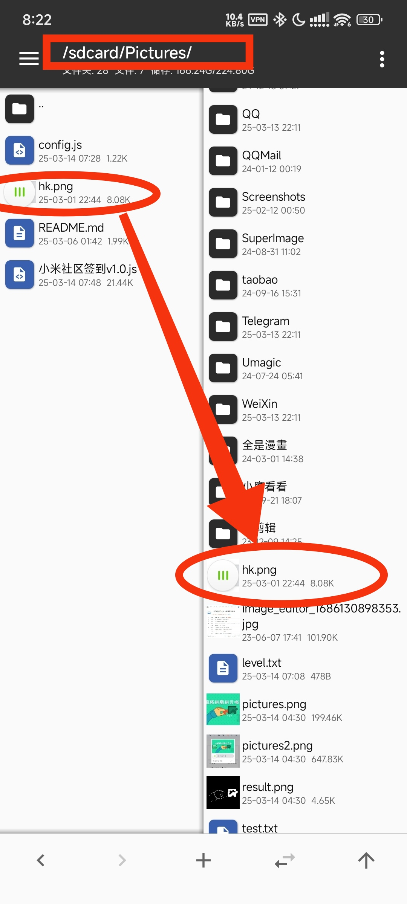
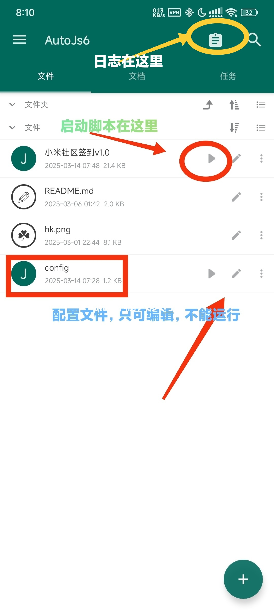
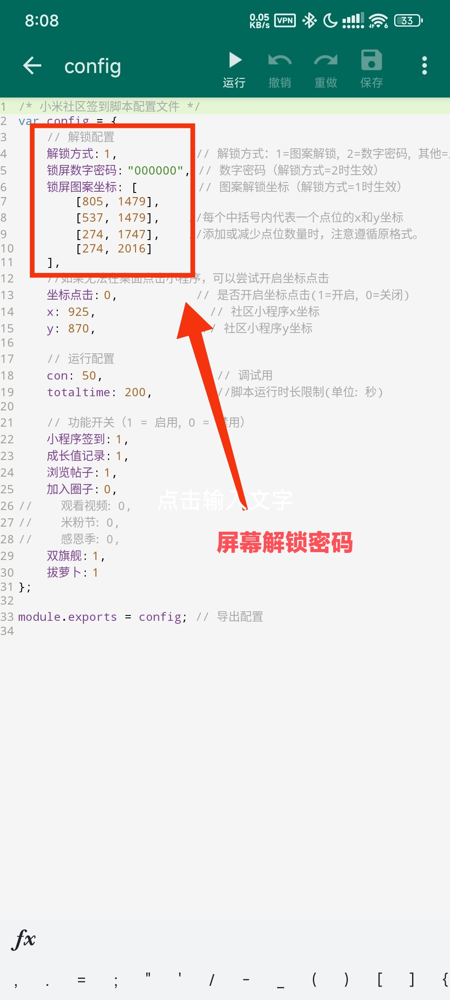
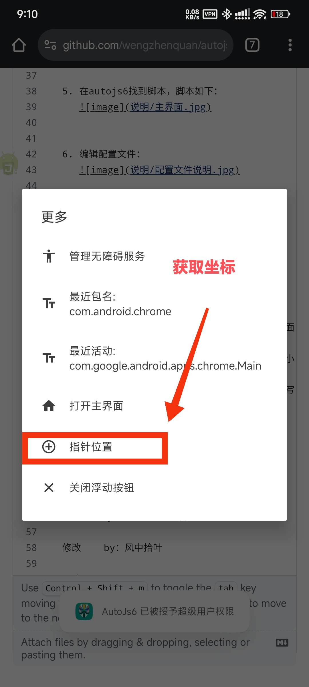

******************************************************************
*   __autojs需要各种权限，左侧边栏内的权限都打开可解决大部分问题！！__

*   __部分手机需要打开 后台弹出界面  的权限，否则无法自动启动社区__

*   __需将验证码界面截图，自行裁切滑块保存至/sdcard/Pictures/hk.png__
******************************************************************


原作者@PJxiaoyu、@fgvsuiye

## 小米社区自动签到脚本！
### 功能：锁屏自动解锁，浏览帖子，签到，过滑块验证，小程序签到等。  

[脚本下载入口](https://github.com/wengzhenquan/autojs6/releases)

1080分辨率可用，其它分辨率可能出错。  

建议使用autojs6最新版  
[点击下载](https://github.com/SuperMonster003/AutoJs6/releases)  


* 使用方法：  
1. 先授权autojs6需要的权限，没root就开启“无障碍服务”，有root推荐授权root权限，页面需要的权限如下：
      


2. 更改autojs6工作路径，允许使用中文，目录在sdcard/下。  
  

3. 将脚本解压到工作路径下，你可以修改文件夹名称，里面的文件别改名就行。  

4. 将hk.png文件复制到/sdcard/Pictures/路径下，这张图片是在1080分辨率的手机下截图的，如果你的手机不是这个分辨率，你可能需要自己截图剪切一张。该图片用于自动滑块验证。  
  


5. 在autojs6找到脚本，脚本如下：  
     


6. 编辑配置文件：  
     

   配置文件里面都有详细说明，这里我需要强调的只有两点：
   
   一. 设置屏幕解锁密码，能够设置定时任务，在夜间自动解锁进行签到，依葫芦画瓢，有多少个点位，就多少行[横坐标x, 纵坐标y]，按解锁顺序，从上到下排列。
   
   图形锁的坐标获取：autojs6→菜单→浮动按钮（第3个），会看到一个小悬浮窗小工具。小工具→…→指针位置。  
     
   当然，如果是数字密码，将“解锁方式”改成2，里面有说明。
   
###   二. 小米社区小程序，必须放在第3屏  
##   （小米社区APP 5.3.0以上版本可不用该操作）。  
   在微信小程序里面，右上角“…”→添加到桌面，然后把图标移动到第3屏即可。  
   如果脚本无法自动识别到，可以通过填写坐标的方式指定位置，坐标获取方法与上面一样。  
    

   
8. 你还等什么？哪来的7？赶快启动试试啊！成功了就定时任务甩起！

----   
## 问题收集：
   1. 为什么小程序打开了没有动作？为什么不会自动打开“小米社区”APP？  
   
   遇到这个问题应该是root用户，并且使用了“隐藏应用列表”（lsposed），  
   当autojs6在隐藏应用列表中的时候，开启了数据隔离，  
   可能会造成对微信小程序、小米社区APP不可见，或者识别受阻现象。  
   ```
   解决：打开“隐藏应用列表”→应用管理→
   autojs6→开启白名单→额外可见的应用{微信、小米社区}，即可！
   ```
   2. 要开始使用AutoJs6录制或投放内容吗？每次需要手动点“立即开始”。  
   需要开启“投影媒体权限”，才能自动跳过这一步。
   ```
   有电脑：下载adb工具，复制开启“投射媒体权限”的命令执行，相关过程自行查询。
   无root、不想用电脑：可通过使用 Shizuku 获得 ADB 特权，可直接开启开启。
   root用户：授权AutoJs6root权限，直接开启。
   ```
  
   

/*

原作者  by：PJ小宇    QQ：898811295

修改    by：风中拾叶

三改   by：wengzhenquan
github：(https://github.com/wengzhenquan/autojs6)

v20250316修改内容如下:

1. 添加首次允许时，链式调用小米社区APP，自动点击“始终允许”
2. 修复双旗舰活动，页面无法关闭问题


v20250315修改内容如下:

1. 修复bug，优化代码。
2. 调换签到顺序，将小程序签到放到最后。
3. 支持5.3.0版本小米社区，从社区APP调用小程序。  
（如果存在微信分身，默认选第1个微信；保留第3屏小程序逻辑）


v20250314修改内容如下:

1. 优化部分代码，提高效率，提高可用性、兼容性。
2. 修复自动寻找“小米社区小程序”逻辑。
3. 注释掉已经下线的活动。
4. 兼容最新版autojs6

*/
